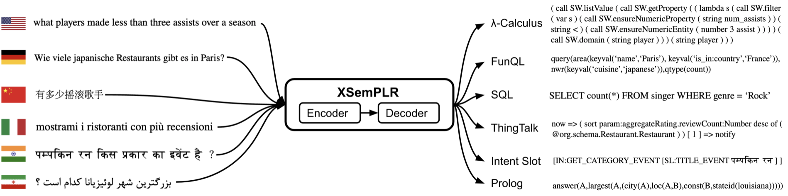
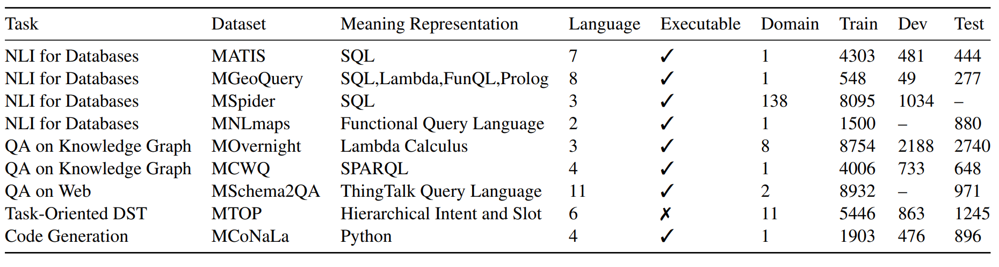
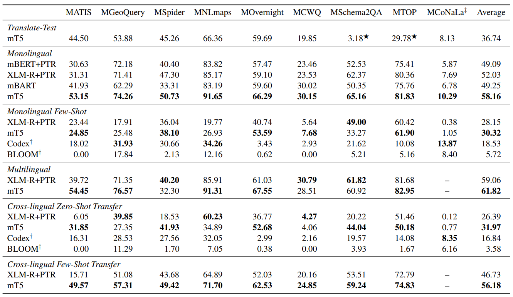

## XSemPLR
This repository maintains datasets and models for ACL 2023 paper [XSemPLR: Cross-Lingual Semantic Parsing in Multiple Natural Languages and Meaning Representations](https://arxiv.org/abs/2306.04085).

Navigation:
[Overview](#overview), 
[Datasets](#datasets),
[Models and Experiments](#models-and-experiments),
[Repository Structure](#repository-structure),
[Citation](#citation),
[License](#license)

## Overview
we present XSEMPLR, a unified benchmark for cross-lingual semantic parsing featured with 22 natural languages and 8 meaning representations by examining and selecting 9 existing datasets to cover 5 tasks and
164 domains. The figure shows the overview of Cross-Lingual Semantic Parsing over various natural languages and meaning representations.


## Datasets
### Statistics

Datasets in XSemPLR. We assemble 9 datasets in various domains for 5 semantic parsing tasks. 
It covers 8 meaning representations. The questions cover 22 languages in 15 language families. Train/Dev/Test columns indicate the number of MRs each paired with multiple NLs.


### Json Files
One can access the train/valid/test set of XSemPLR via `dataset` folder which includes 9 folders for each dataset. The format of one instance in json data is as follows:
```
{
  "db_id": "concert_singer",               // database id, only avaliable for MSpider dataset.
  "question": {                            // queries in natural language.
    "en": "How many singers do we have?",  // English query.
    "zh": "我们有多少歌手？",                // Chinese query.
    "vi": "Có tất cả bao nhiêu ca sĩ ?"    // Vietnamese query.
  },
  "mr": {                                  // meaning representations.
    "sql": "SELECT count(*) FROM singer"   // sql query.
  }                                        // *note that some datasets may contain multiple languages and meaning representations.
}
```
This shows an example of `/data/mspider/dev.json`, note that some datasets may contain multiple languages (`mschema2qa`, `mtop`) and meaning representations (`mgeoquery`).

### Dataset Creation
All datasets can be produced (from raw dataset) by
```
python read_dataset.py
```

## Models and Experiments

### Settings
We consider the following 6 settings for training and testing.
- **Translate-Test**
We train a model on the English training data and translate target NL test data to English using the public [Google NMT system](https://arxiv.org/pdf/1609.08144.pdf). 
- **Monolingual**
We train a monolingual model on each target NL training data. This setting creates one model per target NL. 
- **Monolingual Few-shot**
Additionally, since some target NL training data can be expensive to obtain, we also test a Monolingual Few-shot setting by training monolingual models with only 10\% training data. 
- **Multilingual**
Thanks to the progress in multilingual embeddings and pretrained multilingual language models, we can train one multilingual model on all NL training data. This setting uses only one model to serve all NLs.
- **Cross-lingual Zero-shot Transfer**
Models are trained only on English NL data and then tested on a target-NL test set. This setting uses one model for all target NLs and evaluates the cross-lingual transfer ability without any target-NL training data.
- **Cross-lingual Few-shot Transfer**
Besides, to test the value of additional target NL training data, we finetune the model on 10\% target-NL training data. This Cross-lingual Few-shot Transfer setting creates one model per target NL. 

### Models
We consider 6 models in total in three different groups.
#### Multilingual Pretrained Encoders with Pointer-based Decoders (Enc-PTR)
The first group is multilingual pretrained encoders with decoders augmented with pointers.
Both encoders and decoders use Transformers.
The decoder uses pointers to copy entities from natural language inputs to generate meaning representations.
We use two types of multilingual pretrained encoders, mBERT and XLM-R, and both are trained on web data covering over 100 languages.
#### Multilingual Pretrained Encoder-Decoder Models (Enc-Dec).
The second group uses pretrained encoder-decoder models, including mBART and mT5 which uses text-to-text denoising objective for pretraining over multilingual corpora.

#### Multilingual Large Language Models (LLMs)
The third group is multilingual large language models based on GPT including Codex and BLOOM. Codex is fine-tuned on publicly available code from GitHub. We mainly use these models to evaluate the ability of few-shot learning using in-context learning without any further finetuning. Specifically, we append 8 samples and the test query to predict the MR. For Monolingual Few-shot, samples and the query are in the same NL, while for Cross-lingual Zero-shot Transfer, samples are in English and the query is in the target NL.

### Run the model 
Please check the readme of each model and follow the instruction to set up the environments and run the models. 
To run Enc-PTR, one can `cd \model\seq2seqPTR`. To run Enc-Dec, one can `cd \model\UniPSP`. To run LLMs, one can `cd \model\Codex` for running Codex and `cd \model\BLOOM` for running BLOOM.

### Experiment Results
Results on XSemPLR. We consider 6 settings including 2 Monolingual, 1 Multilingual, and 2 Cross-lingual settings, and one Translate-Test setting. Each number is averaged across different languages in that dataset. * Codex/BLOOM are evaluated on only two settings as we apply 8-shot in-context learning without finetuning the model parameters. Two settings are not applicable to MCoNaLa because it has no training set on NLs other than English. Translate-Test performances on MSchem2QA and MTOP are especially low because the MR of these data also contains tokens in target languages.


## Repository Structure
This figure shows the overview of repository sturcture
```
.
├── assets             // Figures of README.md.                       
├── dataset            // XSemPLR dataset, one dataset per sub-folder.                                
├── model              // Models of XSemPLR, including BLOOM, Codex, mBERT+PTR, XLM-R+PTR, mBART, mT5 on 6 settings.
│   ├── BLOOM          // BLOOM model. See readme in this folder for running.
│   ├── Codex          // Codex model. See readme in this folder for running.  
│   ├── seq2seqPTR     // 2 Enc-PTR models, including mBERT+PTR, XLM-R+PTR. See readme in this folder for running.                 
│   └── UniPSP         // 2 Enc-Dec models, including mBART and mT5. See readme in this folder for running.  
├── utils              // The code to create multilingual, fewshot dataset, and to combine translations.                         
└── read_dataset.py    // Preprocess raw data to create XSemPLR.
```

## Citation
```bibtex
@inproceedings{zhang2023xsemplr,
  title={XSemPLR: Cross-Lingual Semantic Parsing in Multiple Natural Languages and Meaning Representations},
  author={Zhang, Yusen and Wang, Jun and Wang, Zhiguo and Zhang, Rui},
  booktitle={ACL},
  year={2023}
}
```


## License

### Dataset License

We adopt different licenses used by different dataset sources.
- ATIS, LDC User Agreement
- GeoQuery, GPL 2.0
- Spider, CC BY-SA 4.0
- NLMaps, CC BY-NC-SA 4.0
- Overnight, CC BY-SA 4.0
- MCWQ, CC BY 4.0
- Schema2QA, Apache-2.0 License
- MTOP, CC BY-SA 4.0
- MCoNaLa, CC-BY-SA-4.0

### Code License
Our code is distributed under MIT License.
Our implementation is based on the following libraries/repos
- [seq2seqPTR](model/seq2seqPTR), https://github.com/purble/seq2seqPTR, MIT License
- [UniPSP](model/UniPSP), https://github.com/huggingface/transformers, Apache-2.0 License
